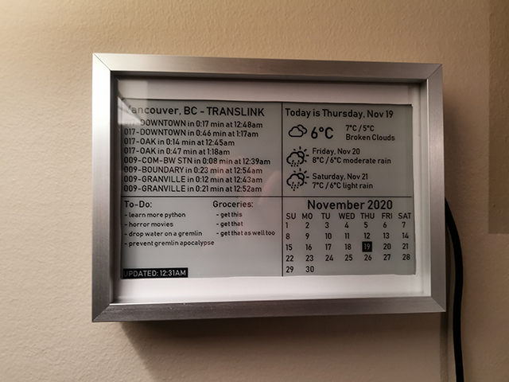
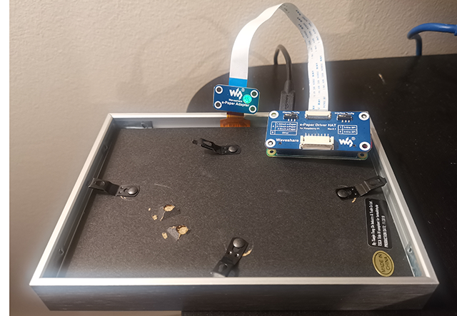
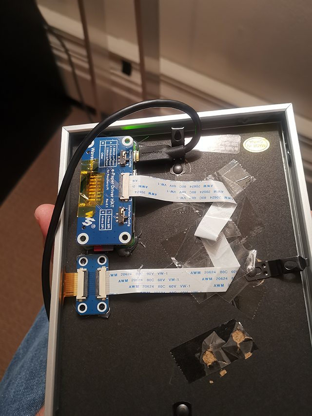

# e_paper_dashboard

E-ink display using Raspberry Pi to display realtime weather, transit information, calendar and soon more.

## Gallery

## Setup

I created a wiki for you to set up the project, please follow it and let me know if you have any issues.

Run `python3 dashboard.py` to start it.
You will need [PIL/Pillow](https://pypi.org/project/Pillow/) for it to run, install it via `pip install Pillow`.

## Note

This code is made for 7.5 inch Version 2 display, if you are using another type of display please
consult the documentation and adjust accordingly.

Go to this website for the e-ink display documentation of how to set it up and get it to work on your
raspberry pi: https://www.waveshare.com/wiki/7.5inch_e-Paper_HAT

I used a Raspberry Pi Zero W for this project however it should work fine on any other Pi as long
as it has GPIO headers.

This is my first project on Github, I'm still learning all its intricasies, if something is missing
please let me know.

Still learning Python and squashing bugs as I progress, there is probably redundancies in the code
so be gentle with it =)

Have fun with it and do something awesome!

## Credit

Inspiration and using some of his code by [Abnormal Distributions](https://github.com/AbnormalDistributions/e_paper_weather_display).
Go check out his cool project.

Icon designs are originally by [Erik Flowers](https://erikflowers.github.io/weather-icons/).
Some icons have been modified.

## Licensing

- Code licensed under [MIT License](http://opensource.org/licenses/mit-license.html)
- Documentation licensed under [CC BY 3.0](http://creativecommons.org/licenses/by/3.0)
- Weather Icons licensed under [SIL OFL 1.1](http://scripts.sil.org/OFL)
